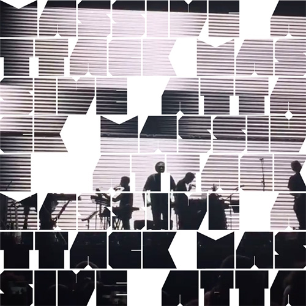

# Unsoundscapes 2.0

This is an ongoing work on my homepage. The idea is to present the short videoclips I took
at the concerts from my [Instagram](https://www.instagram.com/unsoundscapes/).

Each video is masked by a band's name using [the MOD font](http://www.fontfabric.com/mod-font/)
from Fontfabric type foundry.

# Random technical facts

* The video is included using html5 video element
* Masking is implemented using
  [svg mask element](https://developer.mozilla.org/en/docs/Web/SVG/Element/mask)
* The text layout is calculated by measuring the size of words
  and breaking the lines where necessary
* [Instagram recent media endpoint](https://www.instagram.com/developer/endpoints/users/#get_users_media_recent_self)
  is used to fetch the data, check the `download.sh` script
* And of course its being coded in [the Elm language](http://elm-lang.org/),
  just as my [current homepage](https://github.com/w0rm/elm-unsoundscapes)
